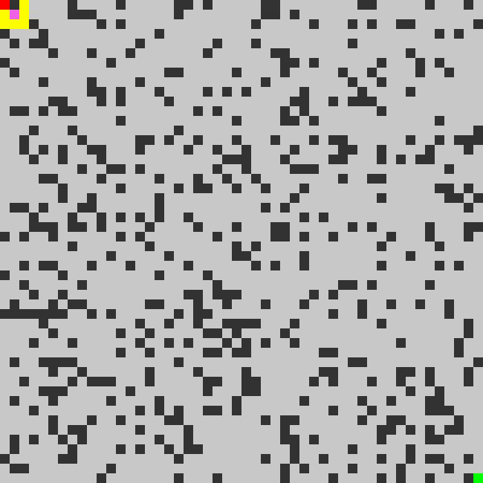

# Motion planning algorithms visualizer

Currently implements the A-star algorithm. Everything is modular and written as functions, and the main algorithm can be swapped out for something else easily.

